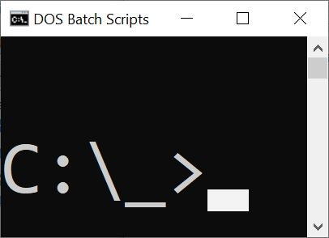

<!--

<
-->
@@Dosbatch_logo@@
# DOS batch scripts

- The ["_" Windows Batch Library](https://github.com/ClicketyClickDK/Underscore) (The "underscore" Windows Batch Library)  
is a collection of generic, ready-to-use batch scripts - and has a life (and repository) of it's own.
- The ["_" Windows Batch Library Tips &amp; Tricks](https://github.com/ClicketyClickDK/Underscore/blob/master/Tips2tricks.md)
- [getBookCover](getBookCover/)  
Download book covers by ISBN
- [How to get piped input in windows batch file? @@Stackoverflow_icon@@](https://stackoverflow.com/a/52583931/7485823)
- [Elevation, local and domain admin](Elevator/)
- [Get Doxy header](get_doxy_header/)
- [`FORFILES`](forfiles/) is The-Windows-way of finding directories and files.
- [Tail](../Powershell/tail.bat) Print the last 30 lines of each FILE to standard output.
- [ISO 86001](Iso86001_date/) - Current date in ISO 86001 (YYYY-MM-DDThh:mm:ss.000z)
- [getGithub.cmd](getGithub.cmd) - Download a repository and unpack specific directory - or entire repo


## ZIP

On Windows 10 build 17063 or later you can use `tar.exe` (Source: [Superuser @@Superuser_icon@@](https://superuser.com/a/1473255) )
```batch
C:\> tar -xf archive.zip
```


## Usefull links

- [DosTips - The DOS Batch Guide @@dostips_icon@@]](https://www.dostips.com).  
This DOS batch guide brings structure into your DOS script by using real function like constructs within a DOS batch file.
 
<!--
### Not so usefull links

- [DOS Batch Programming - Eric Phelps](https://www.ericphelps.com/batch/)
    - Common DOS workarounds and methods to accomplish tasks not covered in the Win9x manual. Particular emphasis on processing lists and lines of data.
- [Converting DOS Batch Files to Shell Scripts](https://linux.die.net/abs-guide/dosbatch)
    - Even the crippled DOS batch file language allowed writing some fairly powerful scripts and applications, though they often required extensive kludges and ...
-->
