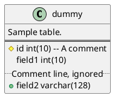

## PUML class diagram to SQLite database schema

Converting a database description from UML Class Scheme:


to SQLite database schema:

```sql
-- # Database created on 2024-11-08T16:45:40+00:00 from default
-- # Created by: Bruger Navn.

/**************************************************
* Table: dummy
* Desc:  Sample table.
**************************************************/
CREATE TABLE IF NOT EXISTS 'dummy'
(
   id                   , -- A comment,
   field1               ,
-- .. Comment line, ignored ..
   field2               ,
  PRIMARY KEY (id)
);
CREATE UNIQUE INDEX 'index_field2' ON 'dummy' ( field2 );
```

using [puml2sqlite.php](puml2sqlite.php)

Test with [basic.puml](basic.puml) or [test.puml](test.puml):
- `php puml2sqlite.php`
- `php puml2sqlite.php basic.pump`
- `php puml2sqlite.php test.puml`

> [!NOTE]
> If the environment variable DEBUG is set and not 0 simple debug info will be written to STDERR

