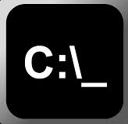
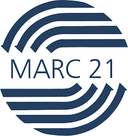
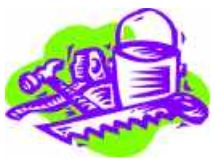
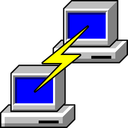
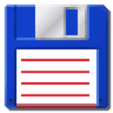
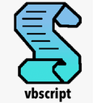
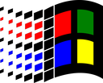

## Tips and Tricks

- [Index](/TipsAndTricks) for various tips and tricks. Index is subdevided by platform

<table border="0"><tr><td>
   <ul>
   <li>- 		      [CSS](/TipsAndTricks/CSS/)
   <li>- 		[DOS batch](/TipsAndTricks/Dosbatch/) 
   <li>-  		[ExifTool](/TipsAndTricks/Exiftools/) 
   <li>- 	[Ghostscript](/TipsAndTricks/Ghostscript/)
   <li>- 	    	[Github](/TipsAndTricks/Github/) 
   <li>-  		[Hardware](/TipsAndTricks/Hardware/)  
   <li>-   			[IPTC](/TipsAndTricks/Iptc/)  
   <li>-  	[Javascripts](/TipsAndTricks/Javascript/)  
   <li>-  		[KeePass](/TipsAndTricks/Keepass/) Password Manager  
   <li>- &#x1F30D;<!--img src="icons/Marc.icon.png" width=32--> 			[Maps](Maps/) Maps in general.
   <li>-  			[MARC?](/TipsAndTricks/Marc/) MARC21, danMARC2, BESmarc
   <li>- 		[Markdown](/TipsAndTricks/Markdown/)
   <li>-    	[Marcedit](/TipsAndTricks/Marcedit/)
   <li>- Microsoft
      - Excel               [Microsoft/Excel](/TipsAndTricks/Microsoft/Excel/)
</ul>
</td><td>
<ul>
   <li>- 		[Notepad++](/TipsAndTricks/Notepad++/)  
   <li>- 				[PHP](/TipsAndTricks/Php/)	 
   <li>- 		[Plantuml](/TipsAndTricks/Plantuml/)  
   <li>- 	[Powershell](/TipsAndTricks/Powershell/)  
   <li>- 			[PuTTY](/TipsAndTricks/Putty/)  
   <li>-  			[Shell](/TipsAndTricks/Shell/)   Linux batch: Shell, Bash, vi etc.
   <li>- 			[SQLite](/TipsAndTricks/SQLite/)   <!--(See also: [SQLite](/SQLite) doublet??)-->
   <li>- 		[Synology](/TipsAndTricks/Synology/)
   <li>- 		[TotalCmd](/TipsAndTricks/TotalCmd/)  
   <li>- 		[Unicode](/TipsAndTricks/Unicode/)   Unicode, UTF-8
   <li>- 		[Vbscript](/TipsAndTricks/Vbscript/)
   <li>- 		M$ [Windows](/TipsAndTricks/Windows/)  
   <li>- 			[Xnview](/TipsAndTricks/Xnview/)
</ul>
</td></tr></table>

<!--
- [Index](/TipsAndTricks) for various tips and tricks. Index is subdevided by platform
   - @@CSS_icon@@		      [CSS](/TipsAndTricks/CSS/)
   - @@Dosbatch_icon@@		[DOS batch](/TipsAndTricks/Dosbatch/) 
   - @@Exiftools_icon@@ 	[ExifTool](/TipsAndTricks/Exiftools/) 
   - @@Ghostscript_icon@@	[Ghostscript](/TipsAndTricks/Ghostscript/)
   - @@Github_icon@@	      [Github](/TipsAndTricks/Github/) 
   - @@Hardware_icon@@ 		[Hardware](/TipsAndTricks/Hardware/)  
   - @@Iptc_icon@@ 			[IPTC](/TipsAndTricks/Iptc/)  
   - @@Javascript_icon@@ 	[Javascripts](/TipsAndTricks/Javascript/)  
   - @@Keepass_icon@@ 		[KeePass](/TipsAndTricks/Keepass/) Password Manager  
   - @@Marc_icon@@ 			[MARC?](/TipsAndTricks/Marc/) MARC21, danMARC2, BESmarc
   - @@Markdown_icon@@		[Markdown](/TipsAndTricks/Markdown/)
   - @@Marcedit_icon@@     [Marcedit](/TipsAndTricks/Marcedit/)
   - Microsoft
      - Excel               [Microsoft/Excel](/TipsAndTricks/Microsoft/Excel/)
   - @@Notepadpp_icon@@		[Notepad++](/TipsAndTricks/Notepad++/)  
   - @@Php_icon@@			   [PHP](/TipsAndTricks/Php/)	 
   - @@Plantuml_icon@@		[Plantuml](/TipsAndTricks/Plantuml/)  
   - @@Powershell_icon@@	[Powershell](/TipsAndTricks/Powershell/)  
   - @@Putty_icon@@			[PuTTY](/TipsAndTricks/Putty/)  
   - @@Shell_icon@@ 		   [Shell](/TipsAndTricks/Shell/)   Linux batch: Shell, Bash, vi etc.
   - @@Sqlite_icon@@		   [SQLite](/TipsAndTricks/SQLite/)   <!--(See also: [SQLite](/SQLite) doublet??)-->
<!--
   - @@Synology_icon@@		[Synology](/TipsAndTricks/Synology/)
   - @@Totalcmd_icon@@		[TotalCmd](/TipsAndTricks/TotalCmd/)  
   - @@Unicode_icon@@		[Unicode](/TipsAndTricks/Unicode/)   Unicode, UTF-8
   - @@Vbscript_icon@@		[Vbscript](/TipsAndTricks/Vbscript/)
   - @@Windows_icon@@		M$ [Windows](/TipsAndTricks/Windows/)  
   - @@Xnview_icon@@		   [Xnview](/TipsAndTricks/Xnview/)
-->

## Data

- [Country.io](https://clicketyclick.github.io/country.io/) mapping ISO country names (**ISO 3166-1 alpha-2** and **ISO 3166-1 alpha-3**)
-  [Word Perfect](/TipsAndTricks/Wordperfect/)
- [Phonenumbers](/TipsAndTricks/phonenumbers.html) <!-- Link to page -->

## External

[devhints.io](https://devhints.io/)
